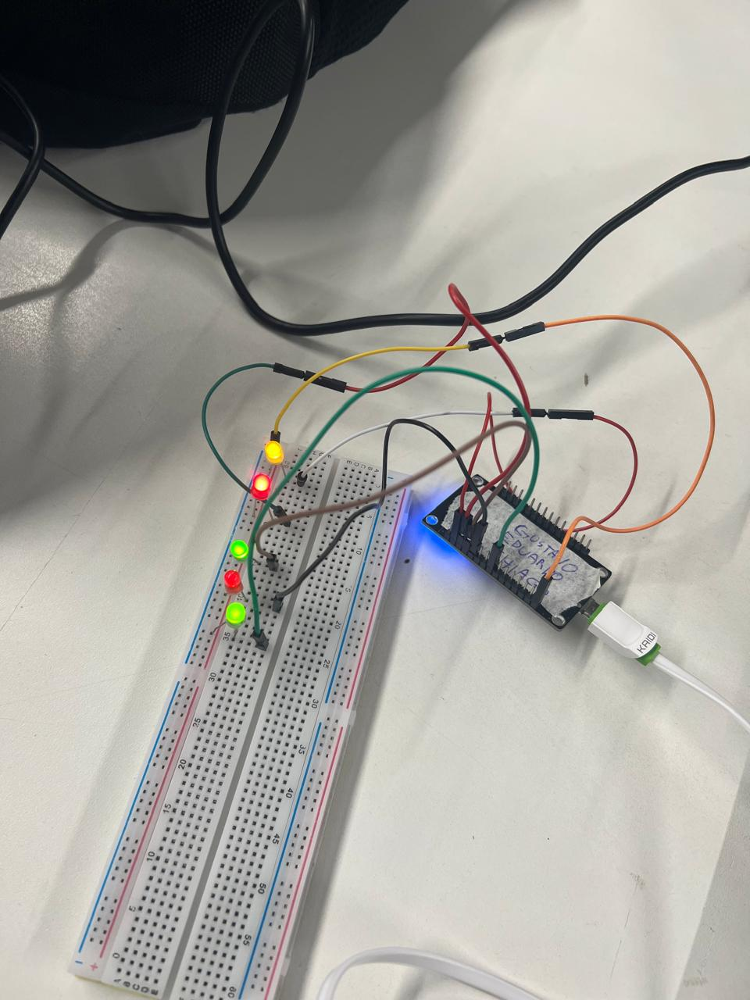

# Projeto MQTT - NodeMCU com Mosquitto e OTA

## Sumário
1. [Visão Geral](#visão-geral)  
2. [Estrutura de Pastas](#estrutura-de-pastas)  
3. [Pré-requisitos](#pré-requisitos)  
4. [Instalação e Configuração](#instalação-e-configuração)  
   - [Drivers do NodeMCU](#drivers-do-nodemcu)  
   - [PlatformIO](#platformio)  
   - [Mosquitto (Broker MQTT)](#mosquitto-broker-mqtt)  
   - [MQTT Explorer (Cliente Gráfico)](#mqtt-explorer-cliente-gráfico)  
5. [Código Fonte](#código-fonte)  
   - [Configurações Wi-Fi e MQTT](#configurações-wi-fi-e-mqtt)  
   - [Callback e Controle do LED](#callback-e-controle-do-led)  
   - [Estrutura de Tópicos](#estrutura-de-tópicos)  
6. [Como Compilar e Carregar](#como-compilar-e-carregar)  
7. [Testes e Exemplos](#testes-e-exemplos)  
8. [Estrutura de Tópicos por Cômodo](#estrutura-de-tópicos-por-cômodo)  
9. [Contribuindo](#contribuindo)  

---

## 1. Visão Geral

Este projeto implementa um sistema de automação residencial utilizando o protocolo MQTT. Ele permite o controle de LEDs em diferentes cômodos via mensagens MQTT com payloads JSON. O broker utilizado é o **Mosquitto**, e o microcontrolador é o **NodeMCU (ESP8266)**. As atualizações do firmware podem ser feitas via OTA (Over-the-Air), sem necessidade de cabo.

**Tópicos “status”:**
- `casa/cozinha/led/status`
- `casa/quarto1/led/status`
- `casa/quarto2/led/status`
- `casa/varanda/led/status`

---

## 2. Estrutura de Pastas

Projeto_MQTT_NodeMCU/
├── .gitignore
├── README.md
├── platformio.ini
└── src/
└── main.cpp


## 3. Pré-requisitos

- NodeMCU ESP8266
- VSCode com a extensão PlatformIO
- Broker MQTT (Mosquitto)
- Cliente gráfico MQTT (MQTT Explorer)
- Rede Wi-Fi local(Celular)

---

## 4. Instalação e Configuração

### Drivers do NodeMCU

Instale os drivers CP210x de acordo com seu sistema:
- [Tutorial da RoboCore](https://www.robocore.net/tutoriais/instalando-driver-do-nodemcu)

### PlatformIO

1. Instale a extensão **PlatformIO IDE** no Visual Studio Code
2. Crie um novo projeto com a placa `NodeMCU 1.0 (ESP-12E Module)`
3. No `platformio.ini`, adicione:
   ```ini
   lib_deps =
       knolleary/PubSubClient
       bblanchon/ArduinoJson
   upload_port = nodemcu.local
Mosquitto (Broker MQTT)
Baixe e instale o Mosquitto:

https://mosquitto.org/download

Edite mosquitto.conf:

listener 1883 0.0.0.0
allow_anonymous true
Libere a porta 1883 no firewall (TCP)

MQTT Explorer (Cliente Gráfico)
Baixe em: https://mqtt-explorer.com

Conecte ao broker usando o IP do seu PC e porta 1883

5. Código Fonte
Configurações Wi-Fi e MQTT
No início do código, configure:

const char* ssid = "SEU_SSID";
const char* password = "SUA_SENHA";
const char* mqtt_server = "192.168.X.X";
const int mqtt_port = 1883;
Callback e Controle do LED
O código escuta os tópicos set e lê mensagens no formato:

{ "estado": "ON" }
Com base nisso, ele acende ou apaga o LED e publica de volta:

{ "estado": "ON" }
Estrutura de Tópicos
set: onde comandos são recebidos

status: onde o NodeMCU responde

6. Como Compilar e Carregar
Conecte o NodeMCU via USB

Clique em Build e depois Upload no PlatformIO

Após o primeiro envio, poderá ser usado via Wi-Fi

7. Testes e Exemplos
Usando o MQTT Explorer:

Tópico: casa/cozinha/led/set

Payload:

{ "estado": "ON" }
Resposta esperada:

Tópico: casa/cozinha/led/status

Payload:

{ "estado": "ON" } - Led ligado

## Imagem do projeto


8. Estrutura de Tópicos por Cômodo

Cômodo	Tópico Set	Tópico Status
Cozinha	casa/cozinha/led/set	casa/cozinha/led/status
Quarto 1	casa/quarto1/led/set	casa/quarto1/led/status
Quarto 2	casa/quarto2/led/set	casa/quarto2/led/status
Varanda	casa/varanda/led/set	casa/varanda/led/status

9. 🤝 Contribuindo
Contribuições são super bem-vindas! Seja para corrigir um erro, melhorar a documentação ou adicionar uma nova funcionalidade, sua ajuda faz toda a diferença. 💪

Para colaborar com este projeto:

Fork o repositório e crie uma branch com um nome claro para sua contribuição.

Faça as alterações desejadas, mantendo o código limpo e organizado.

Envie um Pull Request explicando as mudanças que você fez.

Se for propor algo maior (como uma nova feature ou refatoração), abra antes uma Issue para discutirmos juntos a melhor abordagem.

Siga o estilo e os padrões de codificação existentes para mantermos o projeto coeso.

Vamos evoluir esse projeto de forma colaborativa. Toda contribuição conta! 🚀  

